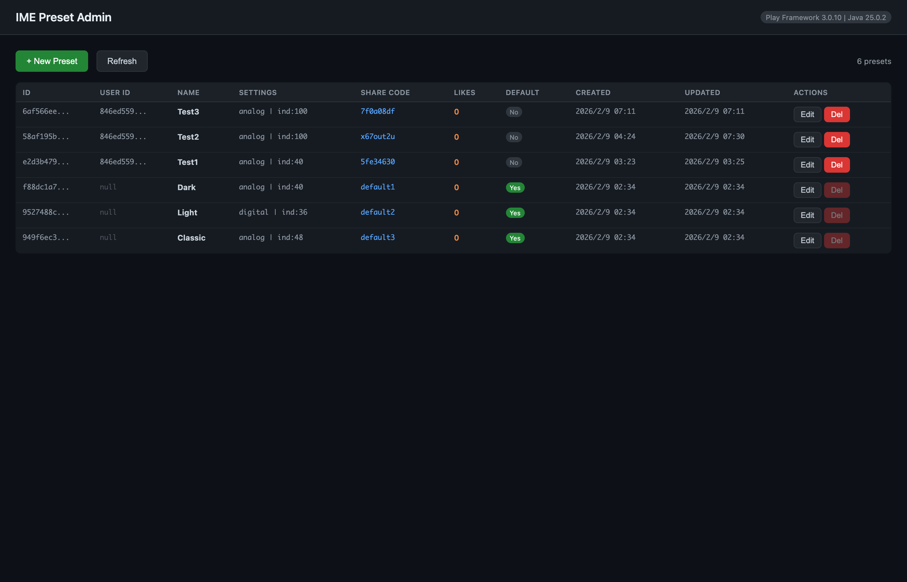
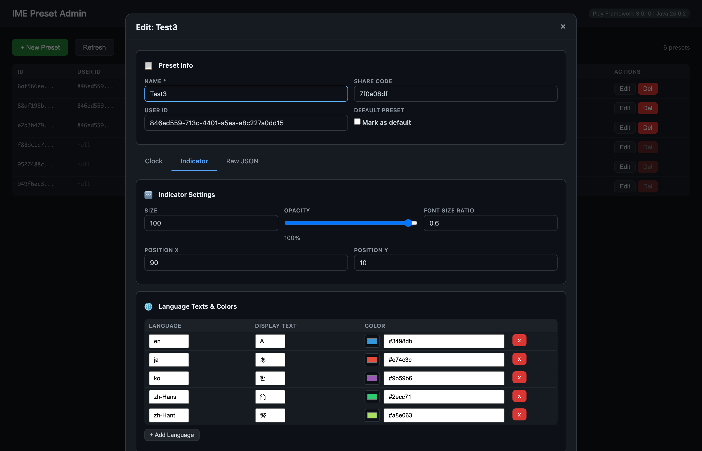

[English](README.md) | [日本語](README_ja.md)

# Play IME Preset Dashboard (Scala)

**Play Framework 3.0** と **Scala 3** で構築した、IMEインジケータ時計プリセット管理用リアクティブREST APIサーバー。

[IME Simulator](https://obott9.github.io/ime-simulator/) と同じスキーマの Supabase PostgreSQL データベースに接続。関数型プログラミングパターン、型安全クエリ、Pekko Streams によるリアクティブデータ配信を実装。ブラウザベースの管理ダッシュボードを内蔵。

## スクリーンショット

| 管理ダッシュボード | インジケータエディタ |
|:---:|:---:|
|  |  |

## 技術スタック

| コンポーネント | 技術 |
|-----------|-----------|
| フレームワーク | [Play Framework 3.0.10](https://www.playframework.com/) (Pekko ベース) |
| 言語 | Scala 3 |
| DB アクセス | [Slick 3.5](https://scala-slick.org/) (Functional Relational Mapping) |
| ストリーミング | [Pekko Streams](https://pekko.apache.org/) (リアクティブストリーミング) |
| データベース | PostgreSQL ([Supabase](https://supabase.com/)) |
| ビルド | sbt 1.10 |

## 機能

- **フル CRUD** — REST API によるプリセットの作成・取得・更新・削除
- **管理ダッシュボード** — `/admin` でアクセスするブラウザベース UI（カラーピッカー、スライダー、言語別インジケータ設定のビジュアルエディタ付き）
- **SSE ストリーミング** — Pekko Streams による Server-Sent Events でのリアルタイムプリセット配信
- **ページネーション** — 件数設定可能、合計件数付き
- **共有コード** — プリセット共有用のユニークコード
- **いいねシステム** — ユーザー追跡付きのいいねトグル
- **人気プリセット** — いいね数でランキング
- **ヘルスチェック** — サーバー状態確認エンドポイント

## Scala の主要パターン

- **不変ケースクラス** によるデータモデル
- **Option/Either** による関数型エラーハンドリング（例外なし）
- **Future ベース** の非同期合成
- **Slick FRM** — 型安全でコンポーザブルなデータベースクエリ
- **Pekko Streams** — バックプレッシャー対応のリアクティブストリーミング（SSE）
- **パターンマッチング** によるリクエスト検証とルーティング
- **リポジトリパターン** — データベースアクセスとコントローラーの明確な分離

## API エンドポイント

| メソッド | パス | 説明 |
|--------|------|-------------|
| `GET` | `/admin` | 管理ダッシュボード（ブラウザ UI） |
| `GET` | `/api/presets` | プリセット一覧（ページネーション） |
| `GET` | `/api/presets/:id` | ID でプリセット取得 |
| `POST` | `/api/presets` | プリセット作成 |
| `PUT` | `/api/presets/:id` | プリセット更新 |
| `DELETE` | `/api/presets/:id` | プリセット削除 |
| `GET` | `/api/presets/shared/:code` | 共有コードで取得 |
| `POST` | `/api/presets/:id/like` | いいねトグル |
| `GET` | `/api/presets/popular` | 人気プリセット |
| `GET` | `/api/presets/stream` | SSE ストリーム (Pekko Streams) |
| `GET` | `/api/health` | ヘルスチェック |

## セットアップ

### 必要条件

- Java 21+
- sbt 1.9+

### 1. Supabase プロジェクト作成

1. [supabase.com](https://supabase.com) で無料プロジェクトを作成
2. **SQL Editor** を開き、`supabase-setup.sql` を実行してテーブルとシードデータを作成

### 2. 環境設定

```bash
cp .env.example .env
```

Supabase の認証情報の確認方法:
1. Supabase プロジェクトのダッシュボードを開く
2. 上部バーの **Connect** をクリック
3. **Direct** タブ > **Session pooler** を選択
4. `host`、`port`、`user` の値をコピー
5. DB パスワードはプロジェクト作成時に設定したもの（Database Settings でリセット可能）

### 3. 起動

```bash
export $(cat .env | xargs) && sbt run
```

ブラウザで `http://localhost:9000/admin` を開く。

## プロジェクト構成

```
app/
  controllers/
    PresetController.scala   # REST API エンドポイント + SSE ストリーミング
  models/
    Tables.scala             # Slick テーブル定義 (Preset, Like)
  repositories/
    PresetRepository.scala   # データベースアクセス層 (Slick クエリ)
conf/
  application.conf           # Play + Slick + CORS 設定
  routes                     # URL ルーティング
public/
  admin.html                 # 管理ダッシュボード（単一ファイル SPA）
```

## 関連プロジェクト

| プロジェクト | 説明 |
|---------|-------------|
| [play-ime-preset-api](https://github.com/obott9/play-ime-preset-api) | 同じ API を **Java 21** + Ebean ORM で実装 |
| [IME Simulator](https://github.com/obott9/ime-simulator) | この API を利用する React フロントエンド |
| [IMEIndicatorClock](https://github.com/obott9/IMEIndicatorClock) | これらのプリセットを使用する macOS デスクトップアプリ |
| [IMEIndicatorClockW](https://github.com/obott9/IMEIndicatorClockW) | これらのプリセットを使用する Windows デスクトップアプリ |

## 注意

管理ダッシュボードは**ローカル開発・デモンストレーション専用**です。認証なしで全データにアクセスできます。本番環境では [IME Simulator](https://github.com/obott9/ime-simulator) フロントエンドが Supabase Auth による所有権ベースのアクセス制御を実装しています。

## 開発

このプロジェクトは Anthropic の [Claude AI](https://claude.ai/) との共同作業で開発されました。

Claudeは以下をサポートしました：
- アーキテクチャ設計とコード実装
- Scala 3 移行
- 管理ダッシュボード UI 開発
- ドキュメントとREADMEの作成

## ライセンス

[MIT](LICENSE)

## サポート

このプロジェクトが役に立ったら、サポートをご検討ください:

[](https://github.com/sponsors/obott9)
[](https://ko-fi.com/obott9)
[](https://buymeacoffee.com/obott9)
